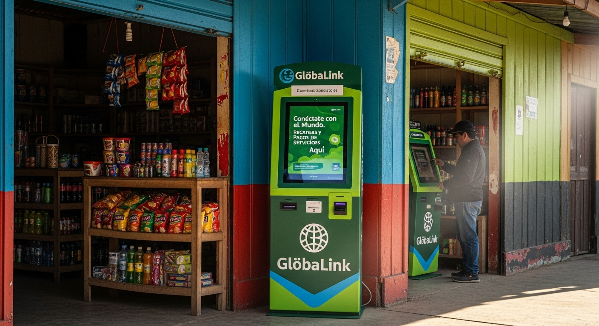
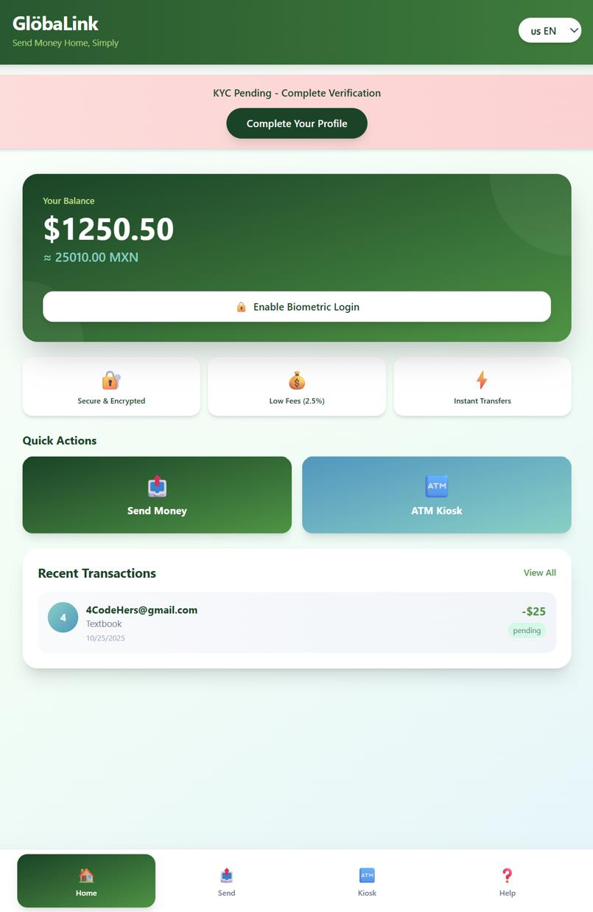
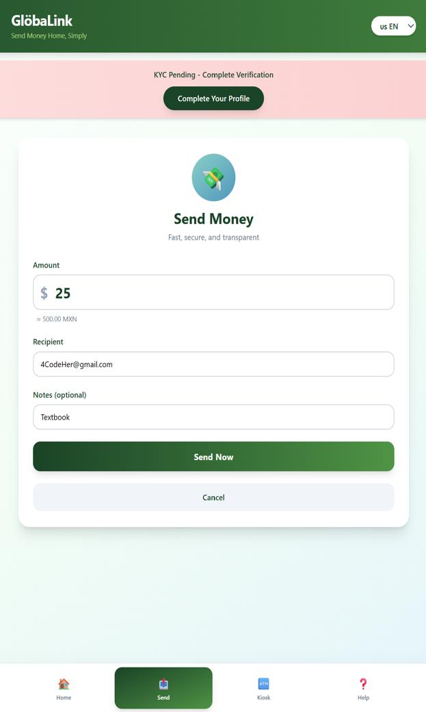
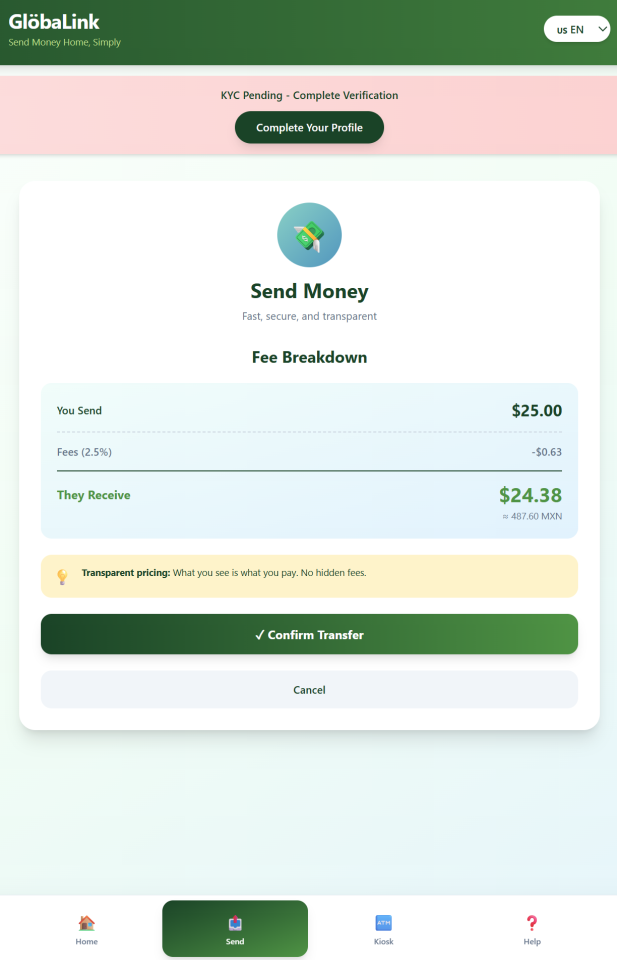
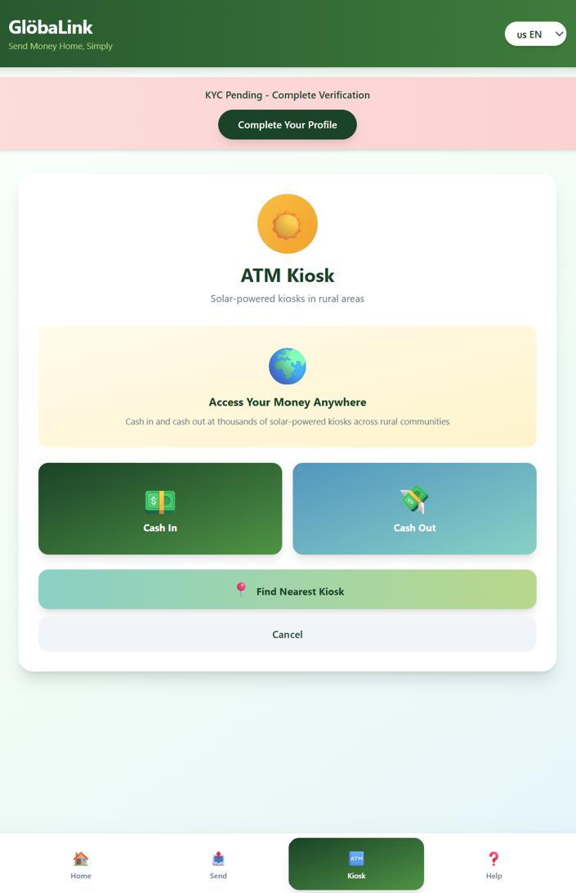
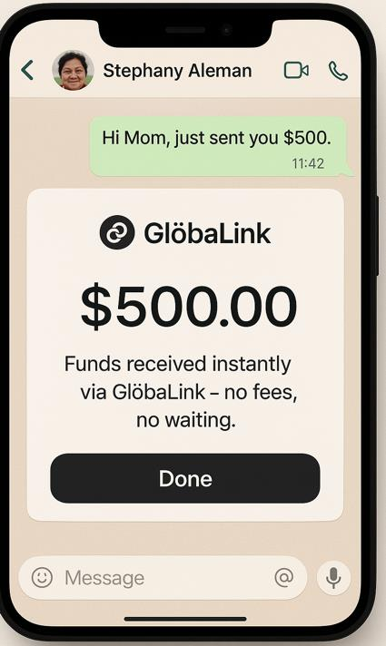
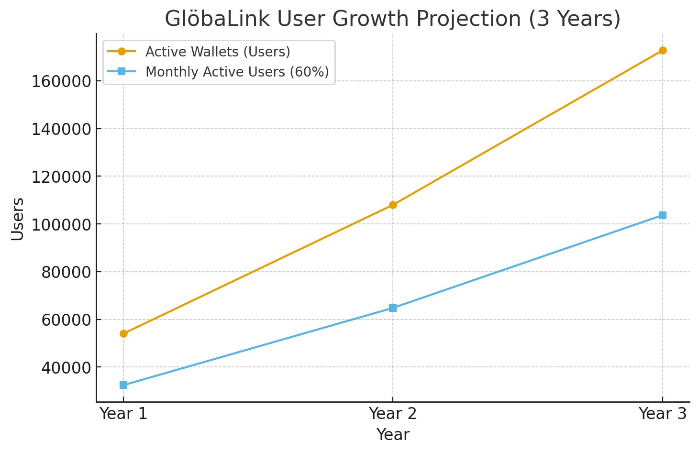
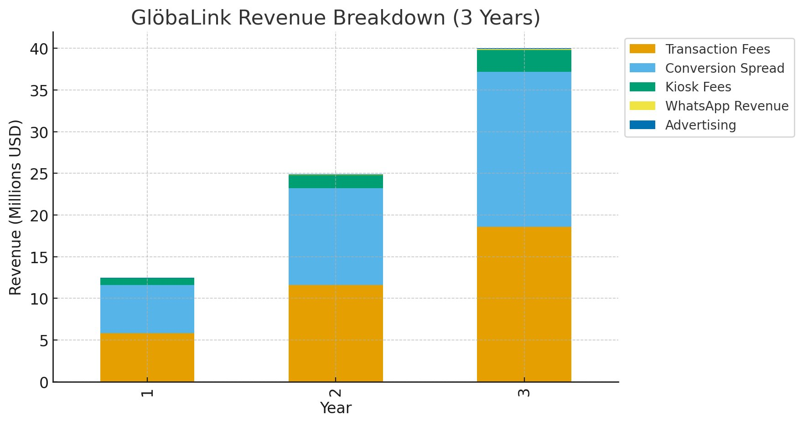
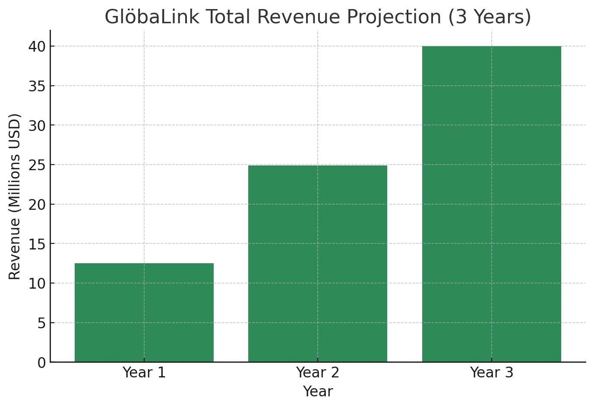
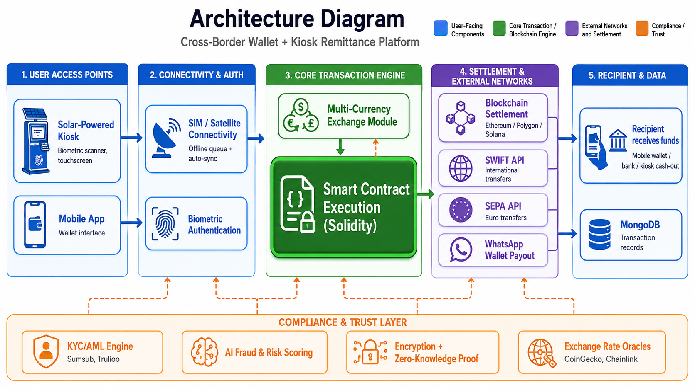

# GlöbaLink 🌐

**Redefining financial access for unbanked and underbanked communities — one solar-powered kiosk at a time.**

> Built for the KSU FinTech Hackathon (Fall 2025) — Challenge: *Global Stablecoin Payment Relay*
> Team: **4CodeHers**

---

## The Problem

Millions of people worldwide — students, migrant workers, small business owners — struggle to send or receive money internationally due to high fees, long delays, and lack of access to traditional banking. Cross-border remittances for unbanked and underbanked populations remain slow, expensive, and inaccessible, disproportionately affecting rural communities with low connectivity.

## The Solution

GlöbaLink is a network of **solar-powered ATM kiosks paired with a mobile wallet app** that let people exchange and send money instantly — even without reliable internet or electricity. Biometric security replaces cards and PINs, fees are transparent, and stablecoin-based settlement keeps costs far below traditional remittance services.

**30-second pitch:** *GlöbaLink empowers rural and underserved communities to connect to the global economy — safely, affordably, and sustainably — through offline-capable kiosks and seamless wallet integration.*

**Tagline:** *We make cross-border payments simple, secure, and transparent — community-verified stablecoins for everyone, anywhere.*

Users need a system that works across borders, devices, and networks — even with low connectivity or limited ID verification — eliminating the need for centralized banks.

| Home | Send Money | Fee Breakdown |
|---|---|---|
|  |  |  |

| ATM Kiosk Access | WhatsApp Confirmation |
|---|---|
|  |  |

Transparent pricing throughout — what you see is what you pay, no hidden fees.

---

## Market Opportunity

| Stat | Figure |
|---|---|
| Global remittances to low/middle-income countries | **$656B USD** |
| People worldwide supported by migrant worker remittances | **1 in 9** |
| Gen Z immigrants facing banking identity verification issues | **54%** |
| International students' contribution to U.S. economy (2023–24) | **$43.8B USD**, 1.1M students |

---

## Who It's For

| Persona | Situation | What GlöbaLink Solves |
|---|---|---|
| **Stephany** | Mother in rural Mexico relying on Western Union | Instant local access, no travel, no reduced payout |
| **Abner** | Foreign exchange student in the U.S. with no bank account | Digital wallet access without high foreign transaction fees |
| **Gabrielle** | First-gen American supporting parents abroad | Fast, transparent, direct-to-phone transfers |

---

## Core MVP Features

1. **Resilient Transaction Connectivity** — SIM/satellite connectivity with offline transaction queuing and auto-sync
2. **Biometric User Authentication** — fingerprint/facial recognition, no cards or PINs
3. **Multi-Currency Exchange Module** — real-time stablecoin-to-fiat conversion
4. **Solar-Powered Kiosk Infrastructure** — 24/7 uptime in off-grid areas
5. **Mobile Wallet & Banking Integration** — interoperability with banks, digital wallets, and mobile money platforms

---

## Compliance & Security

GlöbaLink was designed compliance-first, aligning with:

- **MiCA** (EU stablecoin transparency & consumer protection)
- **GDPR** / **CCPA** (data privacy)
- **FinCEN & FATF** (AML/CTF standards)
- AI-based KYC and real-time fraud/risk scoring
- End-to-end encryption with blockchain immutability and zero-knowledge identity verification

## Business Model

| Category | Details |
|---|---|
| **Customers** | Migrant workers & rural families · Foreign exchange students · First-generation Americans · Small businesses & freelancers · Local governments |
| **Channels** | Mobile app (multilingual, low-bandwidth) · Solar-powered kiosks · WhatsApp integration |
| **Revenue Streams** | Transaction fees (1–2%) · Stablecoin-to-local-currency conversion spread · WhatsApp partnership revenue · Kiosk usage fees · Advertising |
| **Key Partnerships** | Banks & FinTechs (API settlement & compliance) · Local governments (kiosk approvals) · Telecoms & solar providers · WhatsApp/messaging platforms · NGOs & community groups |

**WhatsApp partnership model:** Similar to Apple Pay's integration with iPhone, GlöbaLink would embed directly into WhatsApp — leveraging its global reach for an estimated **$0.50 per active user/year** in partnership revenue.

## Go-To-Market Plan

| Phase | Focus |
|---|---|
| **Awareness** (Pre-Launch) | Digital storytelling, waitlist campaign |
| **Acquisition** (Launch) | Early adopter discounts, multilingual ad campaigns |
| **Engagement & Retention** (Post-Launch) | Expansion beyond WhatsApp, financial education content |

## Global Expansion Roadmap

**Phase 1:** North America → **Phase 2:** LATAM → **Phase 3:** EU → **Phase 4:** APAC/Asia → **Phase 5:** Africa

Current status: **Startup with working prototype/MVP.** Next milestone: full WhatsApp integration.

---

## 3-Year Financial Projections

By Year 3, GlöbaLink projects **170K+ active wallets** with **~104K monthly active users (60% retention)**.

Revenue diversifies over time — starting concentrated in transaction fees and conversion spread, with kiosk fees and emerging WhatsApp/advertising revenue contributing by Year 3.

Total projected revenue grows from **$12.5M (Year 1)** to **$40M (Year 3)**.

---

## Success Metrics

| Category | Metric | Target |
|---|---|---|
| Adoption | Active Wallets | 54K+ in Year 1 |
| Retention | Monthly Active Users | ≥60% of wallets |
| Growth | Referral Conversion Rate | 25% of new users |
| Trust | Reserve Ratio (Proof-of-Reserves) | 100% backed, verified |
| Trust | Community Verifier Nodes | 100+ in pilot year |
| Compliance | Regulatory Compliance Rate | % of audits passed without critical findings |

---

## Tech Stack

- **Smart Contracts:** Solidity (Ethereum)
- **Frontend:** React.js + Tailwind CSS
- **Backend:** Node.js + Express.js
- **Database:** MongoDB
- **Blockchain Networks:** Ethereum, Polygon, Solana
- **Exchange Rate Data:** CoinGecko, Chainlink Oracles
- **KYC/Compliance:** Sumsub, Trulioo
- **Payment Rails:** SWIFT API, SEPA API, WhatsApp Wallet
- **Prototyping:** Vibes.diy

## System Architecture

The system runs on a single backend serving two entry points — kiosk and mobile app — with **smart contract execution sitting at the core of every transaction**, not as a background process. Compliance (KYC/AML, fraud scoring, encryption, exchange rate oracles) operates as a cross-cutting trust layer that gates every stage of the flow rather than a one-time checkpoint.

---

## My Role — Alondra Sanchez (Team Lead, Product)

I led the team and owned **product feature definition** — translating the remittance problem into the five core MVP features, defining the user personas and journeys, and shaping the compliance-first product requirements that guided the rest of the team's work.

**Team contributions:**
- **Alondra Sanchez** — Team Lead, Product Features & Requirements
- **Samara** — Compliance Framework Research & Feature Compliance
- **Felipa** — Marketing & Growth/Revenue Projections
- **Gelsi** — Business Case & Business Modeling, Product Feature Support

---

## Documents

- [Full Product Requirements Document](./docs/product-requirements-document.pdf)
- [Pitch Deck](./docs/pitch-deck.pdf)

## References

- Western Union — [SEPA transfers](https://www.westernunion.com/blog/fr/effectuer-un-virement-sepa-occasionnel/) · [International transfer limits](https://www.westernunion.com/blog/en/fr/international-bank-transfer-what-is-the-maximum-amount/)
- Chainlink — [The convergence powering the next wave of global finance](https://blog.chain.link/the-convergence-powering-the-next-wave-of-global-finance/)
- Yahoo Finance — [Stablecoins revolutionizing global money transfers](https://sg.finance.yahoo.com/news/stablecoins-revolution-global-money-transfers-170327802.html)
- OpenPayd — [Stablecoin infrastructure announcement](https://www.openpayd.com/announcements/openpayd-launches-stablecoin-infrastructure-to-move-and-manage-money-globally/)

---

*Built in 48 hours at the KSU FinTech Hackathon, Fall 2025.*
